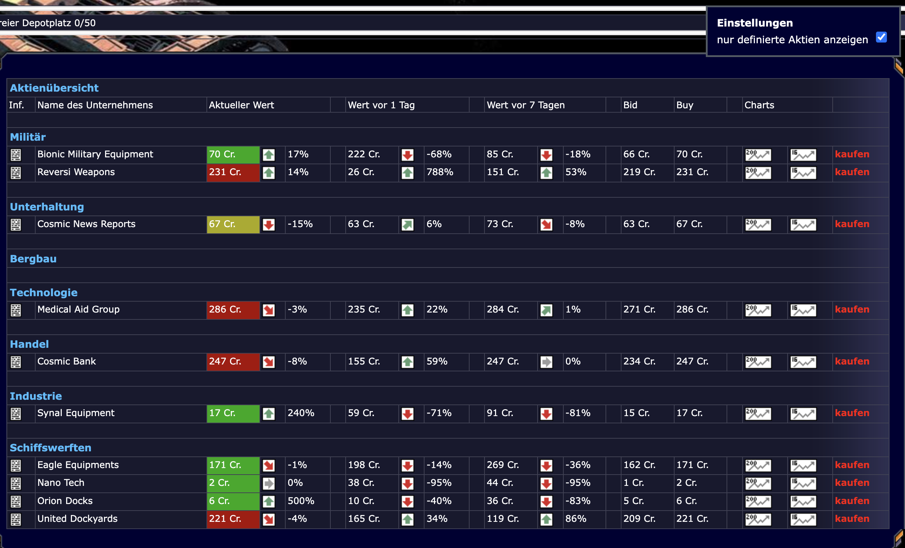

# Scripte zur Erweiterung der Bauzeit-Anzeige

## revorix.aktien.user.js
Aktien-Script zur leichteren Entscheidung beim Aktien-Kauf. Die Aktien bekommen einen passenden schnell lesbaren Farbcode.
Die Werte sind Stand 03/2024 angepasst. 

Ihr könnt sie auch selber im Anfangsteil des Scripts anpassen.
Dazu müsst ihr im Browser das Plugin öffnen, dieses Script hier suchen und editieren.

Neu hinzu gekommen ist die Option, einige Aktien ganz ausblenden zu lassen, damit man sich auf die "sinnvollen" konzentrieren kann. Zum ein-/ausblenden müsst ihr nur die entsprechenden Einträge ein-/auskommentieren (mit // davor). Dann gibts in der Aktienansicht rechts oben ein Häkchen, was die Ansicht umschaltet.

[Aktien Skript installieren](../../../raw/master/aktien/revorix.aktien.user.js)