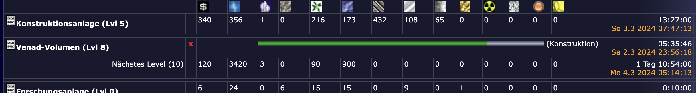
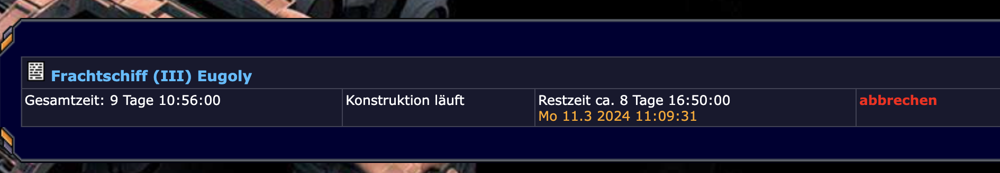

# Scripte zur Erweiterung der Bauzeit-Anzeige

## revorix.bauzeit.user.js
Erweitert die Bauzeit-Anzeige in der Kontruktionsanlage um den Zeitpunkt der Fertigstellung.

[Bauzeit Skript installieren](../../../raw/master/bauzeiten/revorix.bauzeit.user.js)

## revorix.restzeit.user.js
Erweitert die Bauzeit-Anzeige in Entwicklung und Werft um den Zeitpunkt der Fertigstellung.

[Restzeit Skript installieren](../../../raw/master/bauzeiten/revorix.restzeit.user.js)