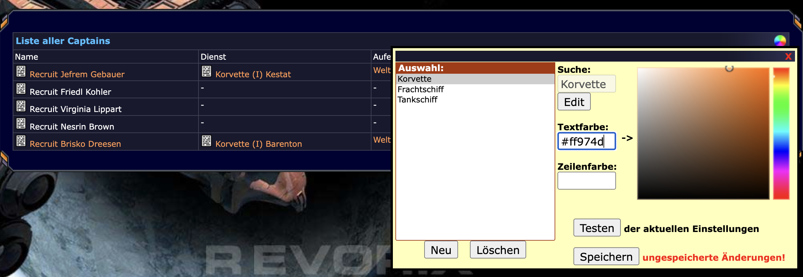
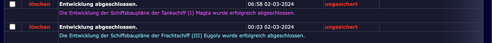
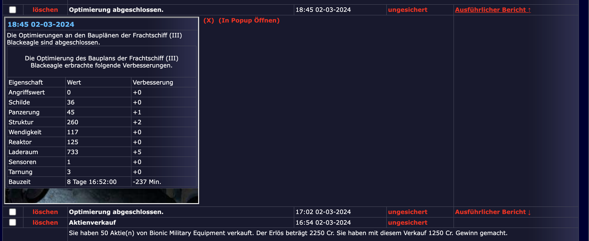
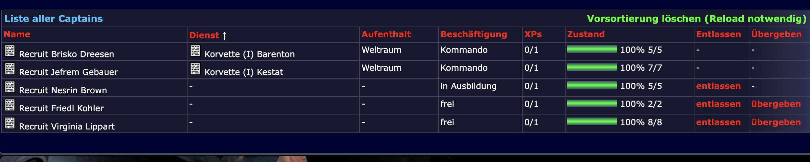

# Scripte die verschiedene Aspekte insgesamt erweitern

## revorix.color-it.user.js
Lässt euch Listeneinträge in News, Schiffsliste, Captainliste und genrell fast allen Tabellen einfärben.
Dabei könnt ihr Suchwörter eintragen und Schriftfarbe und Hintergrundfarbe einstellen.
Zeilen mit dem Suchwort werden dann entsprechend eingefärbt.

[Color-it Skript installieren](https://github.com/tpummer/gm-revorix/raw/master/general/revorix.color-it.user.js)

## revorix.inline-view.user.js
Erweitert die Bauzeit-Anzeige in Entwicklung und Werft um den Zeitpunkt der Fertigstellung.

[Inline-View Skript installieren](https://github.com/tpummer/gm-revorix/raw/master/general/revorix.inline.user.js)

## revorix.sortierung.user.js
Dieses Skript lässt auch Tabellen sortieren. Sicher funktionieren bisher nur Captains und Schiffe. Andere könnten durch Glück gehen, konnten aber noch nicht getestet werden. Bitte meldet Bugs!

[Sortierung Skript installieren](https://github.com/tpummer/gm-revorix/raw/master/general/revorix.sortierung.user.js)

## revorix.werbungsgrenze.user.js
Erweitert die Bauzeit-Anzeige in Entwicklung und Werft um den Zeitpunkt der Fertigstellung.

[Werbungsgrenze Skript installieren](https://github.com/tpummer/gm-revorix/raw/master/general/werbungsgrenze.user.js)